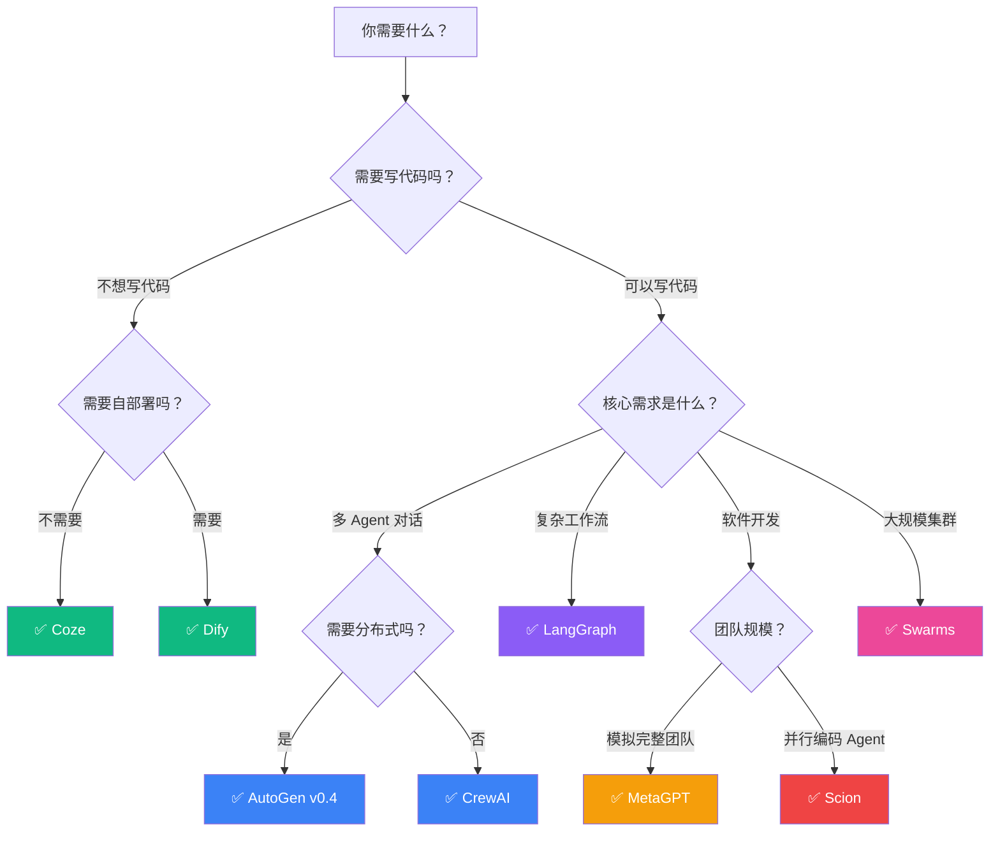

# 🤖 Awesome AI Agent Frameworks — AI Agent 编排框架中文选型指南

[](https://awesome.re)
[](LICENSE)
[](contributing.md)

> **不是又一个链接列表。** 这是一份面向中国开发者的 **AI Agent 框架深度对比 + 选型指引**，包含架构分析、代码示例和决策流程图。

🔥 **热点更新（2026-04-07）**：Google 刚刚开源 [Scion](https://github.com/GoogleCloudPlatform/scion) — 多 Agent 容器编排测试平台，本指南提供首发中文深度解读。[→ 查看 Scion 专题](#scion)

---

## 📊 框架对比总表

| 框架 | 开发者 | 架构类型 | 语言 | 适用场景 | 学习曲线 | 生产就绪度 | Stars |
|------|--------|---------|------|---------|---------|-----------|-------|
| **[Scion](frameworks/scion/)** 🆕 | Google Cloud | 容器编排 | Go | 多 Agent 并行开发 | ⭐⭐⭐⭐ | 🧪 实验 | 新项目 |
| **[AutoGen](frameworks/autogen/)** | Microsoft | 对话驱动 | Python | 多 Agent 对话协作 | ⭐⭐⭐ | ✅ 生产可用 | 42k+ |
| **[CrewAI](frameworks/crewai/)** | CrewAI Inc. | 角色扮演 | Python | 团队协作任务 | ⭐⭐ | ✅ 生产可用 | 28k+ |
| **[LangGraph](frameworks/langgraph/)** | LangChain | 状态图 | Python/JS | 复杂工作流编排 | ⭐⭐⭐⭐ | ✅ 生产可用 | 12k+ |
| **[MetaGPT](frameworks/metagpt/)** | DeepWisdom | SOP 驱动 | Python | 软件开发模拟 | ⭐⭐⭐ | 🟡 可用 | 48k+ |
| **[Swarms](frameworks/swarms/)** | Swarms Corp | 群体智能 | Python | 大规模 Agent 集群 | ⭐⭐⭐ | 🟡 可用 | 4k+ |
| **[Dify](frameworks/dify/)** | Dify.AI | 可视化编排 | Python/TS | 低代码 AI 应用 | ⭐ | ✅ 生产可用 | 62k+ |
| **[Coze](frameworks/coze/)** | 字节跳动 | 可视化平台 | — | 快速搭建 Bot | ⭐ | ✅ 生产可用 | 平台级 |

> 💡 **Stars 数据截至 2026 年 4 月。** 学习曲线 ⭐ 越少越容易上手。

---

## 🔍 维度说明

| 维度 | 含义 |
|------|------|
| **架构类型** | 框架的核心编排模式（对话、图、角色、容器等） |
| **适用场景** | 最擅长解决什么类型的问题 |
| **部署方式** | 本地/云/Kubernetes/SaaS |
| **语言支持** | 主要开发语言 |
| **社区活跃度** | GitHub Stars、Issue 响应、生态插件数量 |
| **学习曲线** | 从入门到能跑通生产 demo 的时间 |
| **生产就绪度** | 能否用于生产环境（🧪实验 / 🟡可用 / ✅生产） |

---

## 📦 框架详解

### Scion

> **Google Cloud 刚开源的多 Agent 容器编排测试平台** — [详细解读 →](frameworks/scion/)

Scion 的核心理念是 **"少即是多"**：不规定死板的编排模式，而是让 Agent 自行通过 CLI 工具学习如何协调。每个 Agent 运行在独立容器中，拥有独立的 git worktree 和凭证。

```bash
# 快速体验
go install github.com/GoogleCloudPlatform/scion/cmd/scion@latest
cd my-project
scion init
scion start debug "Help me debug this error" --attach
```

**核心概念**：Grove（项目空间）→ Agent（容器化进程）→ Hub（控制平面）→ Runtime Broker（算力节点）

### AutoGen

> **Microsoft 的对话驱动多 Agent 框架** — [详细解读 →](frameworks/autogen/)

AutoGen 围绕 **多 Agent 对话** 构建，Agent 通过自然语言消息传递协作。v0.4 版本重构为事件驱动架构，支持分布式部署。

```python
from autogen_agentchat.agents import AssistantAgent
from autogen_agentchat.teams import RoundRobinGroupChat

agent = AssistantAgent("assistant", model_client=model_client)
team = RoundRobinGroupChat([agent])
result = await team.run(task="写一个冒泡排序")
```

### CrewAI

> **最直觉的角色扮演多 Agent 框架** — [详细解读 →](frameworks/crewai/)

CrewAI 用 **角色（Agent）+ 任务（Task）+ 团队（Crew）** 三层抽象，像组建一支团队一样编排 AI。

```python
from crewai import Agent, Task, Crew

researcher = Agent(role="研究员", goal="深度调研", backstory="资深行业分析师")
task = Task(description="调研 2026 年 AI Agent 趋势", agent=researcher)
crew = Crew(agents=[researcher], tasks=[task])
result = crew.kickoff()
```

### LangGraph

> **LangChain 生态的状态图工作流引擎** — [详细解读 →](frameworks/langgraph/)

LangGraph 将 Agent 工作流建模为 **有向图**，节点是处理步骤，边是条件转移。支持持久化状态和人类介入。

```python
from langgraph.graph import StateGraph

graph = StateGraph(State)
graph.add_node("research", research_node)
graph.add_node("write", write_node)
graph.add_edge("research", "write")
app = graph.compile()
```

### MetaGPT

> **用 SOP 驱动的软件公司模拟器** — [详细解读 →](frameworks/metagpt/)

MetaGPT 让多个 Agent 模拟软件公司的角色（产品经理、架构师、工程师），按照 **标准化流程（SOP）** 协作开发。

```python
from metagpt.software_company import generate_repo
await generate_repo(idea="开发一个天气查询 CLI 工具")
# 自动生成：PRD → 系统设计 → 代码 → 测试
```

### Swarms

> **面向大规模 Agent 集群的群体智能框架** — [详细解读 →](frameworks/swarms/)

Swarms 支持数百个 Agent 并发运行，提供多种编排模式（顺序、并行、层级、混合）。

```python
from swarms import Agent, SequentialWorkflow

agents = [Agent(agent_name=f"worker-{i}", llm=model) for i in range(5)]
workflow = SequentialWorkflow(agents=agents)
result = workflow.run("分析这份季度报告")
```

### Dify

> **开源的可视化 AI 应用开发平台** — [详细解读 →](frameworks/dify/)

Dify 提供拖拽式画布编排 Agent 工作流，内置 RAG、工具调用、对话管理。适合不想写代码的团队。

- 可视化 Workflow 画布
- 内置知识库（RAG）管理
- 一键部署为 API 或 Web 应用
- 支持 OpenAI/Claude/本地模型

### Coze

> **字节跳动的 AI Bot 搭建平台** — [详细解读 →](frameworks/coze/)

Coze（扣子）是字节跳动的 AI 应用开发平台，通过可视化界面搭建 Bot，支持插件、工作流、知识库。国内版直接对接豆包大模型。

- 零代码搭建 AI Bot
- 丰富的官方插件市场
- 一键发布到飞书/微信/网页
- 国内版 + 海外版双平台

---

## 🧭 选型决策流程图

> 不知道选哪个？回答几个问题，找到最适合你的框架。[详细版 →](decision-guide.md)



---

## 🏗️ 架构模式对比

| 模式 | 代表框架 | 核心思想 | 优点 | 缺点 |
|------|---------|---------|------|------|
| **对话驱动** | AutoGen | Agent 通过消息传递协作 | 灵活、自然 | 输出不可控 |
| **角色扮演** | CrewAI | 定义角色 + 任务 + 团队 | 直觉、易上手 | 深度定制受限 |
| **状态图** | LangGraph | 有向图 + 条件分支 | 精确控制流 | 学习曲线陡 |
| **SOP 流程** | MetaGPT | 模拟真实团队 SOP | 结构化输出 | 不够灵活 |
| **容器编排** | Scion | 每 Agent 独立容器 | 真隔离、可扩展 | 运维复杂度高 |
| **可视化** | Dify/Coze | 拖拽式画布 | 零代码 | 灵活性有限 |
| **群体智能** | Swarms | 大量 Agent 并行 | 规模大 | 协调成本高 |

---

## 📈 选型速查表

### 按场景

| 场景 | 推荐 | 备选 |
|------|------|------|
| 快速搭建 AI 客服 Bot | Coze / Dify | CrewAI |
| 多 Agent 代码协作 | **Scion** | AutoGen |
| 复杂审批/决策工作流 | LangGraph | AutoGen |
| 模拟软件开发团队 | MetaGPT | CrewAI |
| 数据分析 Pipeline | LangGraph | AutoGen |
| 内容创作团队 | CrewAI | MetaGPT |
| 大规模并行处理 | Swarms / Scion | AutoGen |
| 企业内部 AI 平台 | Dify | LangGraph |

### 按团队

| 团队类型 | 推荐 |
|---------|------|
| 非技术团队 | Coze → Dify |
| 初创团队（快速验证） | CrewAI → AutoGen |
| 中大型工程团队 | LangGraph → Scion |
| AI 研究团队 | AutoGen → MetaGPT |

---

## 🔗 相关资源

- [Google ADK (Agent Development Kit)](https://github.com/google/adk-python) — Google 的 Agent 开发工具包
- [OpenAI Agents SDK](https://github.com/openai/openai-agents-python) — OpenAI 官方 Agent SDK
- [Anthropic Claude MCP](https://modelcontextprotocol.io/) — Model Context Protocol
- [A2A Protocol](https://github.com/google/A2A) — Google Agent-to-Agent 通信协议

---

## 🤝 贡献

欢迎贡献！请阅读 [贡献指南](contributing.md)。

- 🐛 发现错误？[提 Issue](https://github.com/Vincentwei1021/awesome-ai-agent-frameworks/issues)
- ✨ 想加新框架？[提 PR](https://github.com/Vincentwei1021/awesome-ai-agent-frameworks/pulls)
- 💬 讨论交流？[Discussions](https://github.com/Vincentwei1021/awesome-ai-agent-frameworks/discussions)

---

## 🔗 更多中文 AI 实战指南

| 项目 | 简介 |
|------|------|
| [📈 Kronos 中文实战指南](https://github.com/Vincentwei1021/kronos-guide-cn) | 金融 K 线基础模型 · A 股预测 · 微调 · 回测集成 |
| [🚀 MegaTrain 中文实战指南](https://github.com/Vincentwei1021/megatrain-guide-cn) | 单 GPU 训练 100B+ 大模型 · 硬件选购 · 性能对比 |

---

## 📄 许可证

[MIT License](LICENSE) © 2026

---

<p align="center">
  <b>如果这个项目对你有帮助，请给一个 ⭐ Star！</b>
</p>
