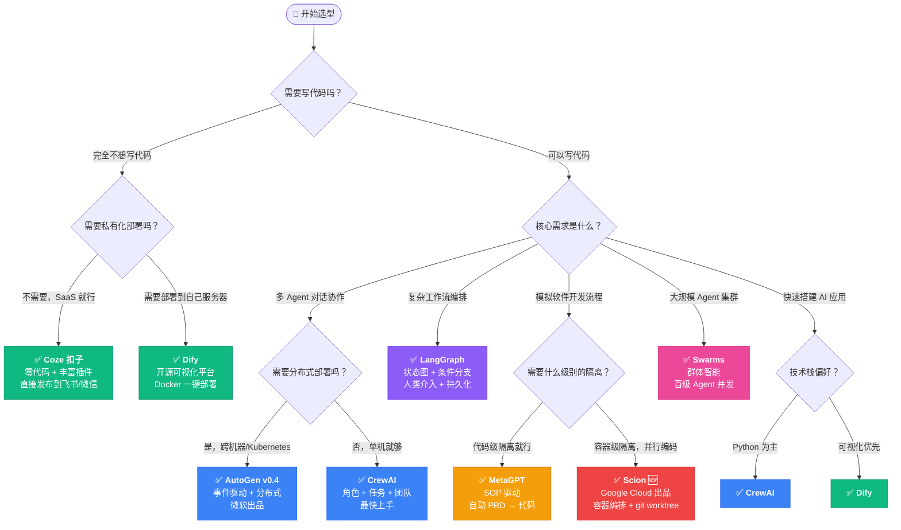

# 🧭 AI Agent 框架选型决策指南

> 回答几个关键问题，找到最适合你的框架。

## 决策流程图

---

## 关键决策因素

### 1. 团队技术水平

| 水平 | 推荐路径 |
|------|---------|
| **非技术人员** | Coze（纯界面）→ Dify（低代码） |
| **初级开发者** | CrewAI（最简 API）→ AutoGen（渐进复杂） |
| **高级开发者** | LangGraph（精确控制）→ Scion（容器编排） |
| **AI 研究者** | AutoGen（可定制对话）→ MetaGPT（SOP 实验） |

### 2. 部署环境

| 环境 | 推荐 |
|------|------|
| **纯 SaaS** | Coze |
| **Docker 单机** | Dify / CrewAI / AutoGen |
| **Kubernetes 集群** | Scion / AutoGen v0.4 |
| **笔记本/本地开发** | CrewAI / LangGraph |

### 3. Agent 数量

| 规模 | 推荐 |
|------|------|
| **1-3 个 Agent** | CrewAI / LangGraph |
| **3-10 个 Agent** | AutoGen / MetaGPT / Scion |
| **10-100+ 个 Agent** | Swarms / Scion（K8s 模式） |

### 4. 是否需要人类介入

| 需求 | 推荐 |
|------|------|
| **完全自动** | CrewAI / MetaGPT / Swarms |
| **关键节点审批** | LangGraph（内置 human-in-the-loop） |
| **随时 attach 交互** | Scion（tmux attach/detach） |

---

## 组合方案

有时候不是非此即彼，框架可以组合使用：

| 组合 | 场景 |
|------|------|
| **Dify + LangGraph** | 可视化管理 + 复杂内部逻辑 |
| **Scion + CrewAI** | 容器隔离 + 内部用 CrewAI 编排 |
| **AutoGen + LangGraph** | 对话协作 + 工作流控制 |
| **Coze + Dify** | 前端快速搭建 + 后端自研能力 |

---

## 总结一句话

| 框架 | 一句话 |
|------|--------|
| **Scion** | "给每个 Agent 一个容器，让它们自己学会协作" |
| **AutoGen** | "Agent 之间像人一样聊天解决问题" |
| **CrewAI** | "组一支 AI 团队，分工明确，开干" |
| **LangGraph** | "画一张图，精确控制每一步" |
| **MetaGPT** | "模拟一个软件公司，从 PRD 到代码全自动" |
| **Swarms** | "放出一群 Agent，蚁群智能" |
| **Dify** | "拖拖拽拽就能搭 AI 应用" |
| **Coze** | "最快 5 分钟上线一个 AI Bot" |
